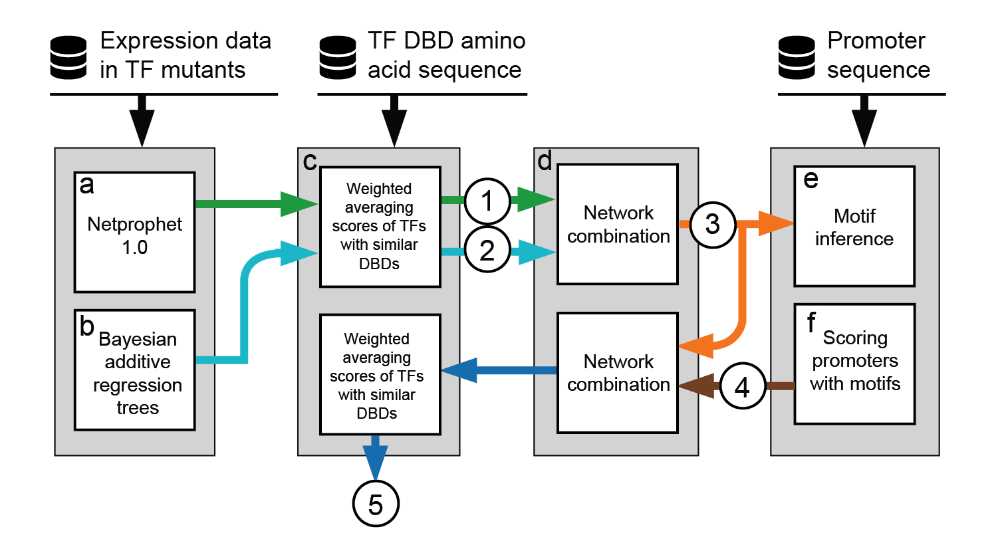

# NetProphet 2.0

NetProphet 2.0 is our second-generation “data light” TF-network mapping algorithm. It requires only data that can be generated from low-cost, reliable, and easily scalable experimental methods. NetProphet 2.0 relies on three fundamental ideas. First, combining several expression-based network algorithms that use different types of models can yield better results than using either one alone. Second, TFs with similar DNA binding domains (in terms of amino acid sequence) tend to bind similar sets of target genes. Third, even an imperfect net-work map can be used to infer models of each TF’s DNA binding prefer-ences from the promoter sequences of its putative targets and these mod-els can be used to further refine the network. The following is our algorithm overview.



Our implementation is available for both serial processing on a local desktop and parallel computing on a HPC cluster. The parallel computing mode requires the SLURM workload manager for job scheduling. 

### Wiki Page

Please find the details on installation, data preparation, code execution, and result interpretation in our wiki page [here](https://github.com/yiming-kang/NetProphet_2.0/wiki).

### Basic Usage

Let's run NetProphet in parallel processing mode on your HPC cluster:

```
conda activate np2
sbatch [--mail-type=END,FAIL --mail-user=<your_email>] NetProphet2 -f <config_file>
```

Alternatively, run serial processing mode on your MacOS or Linux desktop:

```
conda activate np2
./NetProphet2 -s -f <config_file>
```

After execution, you will see following messages that monitor the progress:
	
```
Unlocking working directory.
Provided cores: 2
Rules claiming more threads will be scaled down.
Job counts:
	count	jobs
	1	all
	1	assemble_final_network
	1	build_motif_network
	1	combine_npwa_bnwa
	1	infer_motifs
	1	make_directories
	1	map_bart_network
	1	map_np_network
	1	prepare_resources
	1	score_motifs
	1	weighted_average_bart_network
	1	weighted_average_np_network
	12
rule make_directories:
	output : ...
1 of 12 steps (8%) done
rule prepare_resources:
...
2 of 12 steps (17%) done
...
...
...
12 of 12 steps (100%) done
```

> NOTE: The resource data provided is used for mapping a Yeast subnetwork. Visit http://mblab.wustl.edu/software.html for the resources for mapping whole TF network in yeast and fruit fly.


### References

Kang, Y, et al. NetProphet 2.0: Mapping Transcription Factor Networks by Exploiting Scalable Data Resources. Bioinformatics 2018;34(2):249–257.

Haynes, B.C., et al. Mapping functional transcription factor networks from gene expression data. Genome research 2013;23(8):1319-1328.

Chipman, H.A., George, E.I. and McCulloch, R.E. BART: Bayesian additive regression trees. 2010:266-298.

Köster, Johannes and Rahmann, Sven. “Snakemake - A scalable bioinformatics workflow engine”. Bioinformatics 2012.

Elemento, O., Slonim, N. and Tavazoie, S. A universal framework for regulatory element discovery across all genomes and data types. Mol Cell 2007;28(2):337-350.

Grant, C.E., Bailey, T.L. and Noble, W.S. FIMO: scanning for occurrences of a given motif. Bioinformatics (Oxford, England) 2011;27(7):1017-1018.

Smyth GK. 2005. "Limma: Linear models for microarray data". Bioinformatics and computational biology solutions using R and Bioconductor (ed. Gentleman R, et al.), pp. 397–420. Springer, New York.

Efron, Bradley; Hastie, Trevor; Johnstone, Iain; Tibshirani, Robert. Least angle regression. Ann. Statist. 32 (2004), no. 2, 407--499.

Yu, Hao. "Rmpi: parallel statistical computing in R." R News 2.2 (2002): 10-14.

